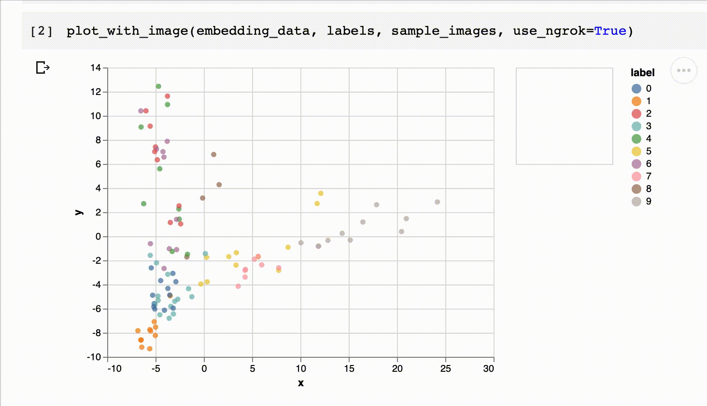

# Serving interactive charts with images - based on Altair

Project fully supports Google Colab. For more details see [examples](examples)

## Installation
```sh
pip install altair-images
```

## How to use
```python
import numpy as np

from altair_images import plot_with_image

embedding_data = np.load('../tests/pca_data_100.npy')
sample_images = np.load('../tests/sample_images_100.npy')
labels = np.load('../tests/sample_labels_100.npy')

plot_with_image(embedding_data, labels, sample_images)
```



## TODO
- [ ] Add examples in readme
- [ ] Add CI for tagging and publishing new version from master
- [ ] Add tests
- [ ]